# 👋 Hi, I'm Mohsin Sheraz

### ML Engineer · Computer Vision · Edge AI · Data Scientist

---

### 🚀 About Me

I am an **ML & Computer Vision Engineer** specializing in deploying high-performance models from **data → edge deployment → production pipelines**.

- 💼 **ML Engineer** at **Talkpool Pakistan**
- 🎓 **MS Data Science** (Shifa Tameer-e-Millat University) · **BS Mathematics** (University of Sargodha)
- 🔬 **Research Focus:** Explainable AI (XAI), Predictive Maintenance, Edge AI, and Model Compression
- ⚙️ **Core Stack:** Python, PyTorch, OpenCV, YOLO, TensorRT, FastAPI, Docker, AWS

---

### 🧠 Tech Stack

| Domain | Technologies |
|---|---|
| **Core & Languages** | `Python` `SQL` `Bash` `C++` |
| **ML & Deep Learning** | `PyTorch` `TensorFlow` `Scikit-Learn` `Pandas` `NumPy` `XGBoost` |
| **Computer Vision & Edge** | `OpenCV` `Ultralytics YOLO` `TensorRT` `ONNX` `NVIDIA Jetson` |
| **Backend & Cloud** | `FastAPI` `Django` `PostgreSQL` `Docker` `AWS` `Git/GitHub` |

---

### 🔥 Featured Projects & Research

<b>🛡️ Real-Time PPE Safety Detection System (Edge AI)</b>

 

An end-to-end industrial safety monitoring solution deployed on **NVIDIA Jetson Orin Nano** with live RTSP CCTV feeds.
- **Detections:** Helmet, Vest, Gloves, Safety Shoes, Harness, Person.
- **Pipeline:** `CCTV Stream` ➔ `Jetson Orin Nano` ➔ `YOLO (TensorRT Engine)` ➔ `Rule Engine` ➔ `FastAPI Backend` ➔ `AWS Storage & Alerts`.
- **Highlights:** Real-time multi-stream inference, custom synthetic augmentation, and automated safety rule violations.

<b>🔬 EcoX-Edge: Sustainable Predictive Maintenance & XAI</b>

 

Master's research framework for Remaining Useful Life (RUL) estimation on high-frequency industrial telemetry.
- **Architecture:** Hybrid CNN-Transformer backbone for multi-variate time series.
- **Optimization:** Structured Pruning & INT8 Quantization for ultra-low latency edge devices.
- **Explainability:** Integrated SHAP and multi-head attention maps for transparent engineering decisions.

---

### 📈 GitHub Statistics & Activity

  

  

  

---

### 🤝 Connect & Collaborate

I am always open to collaborating on **Computer Vision, Edge AI, Predictive Maintenance, and Production MLOps**.

- 💼 [LinkedIn](https://www.linkedin.com/in/mohsin-sheraz-142nb/)
- 🐙 [GitHub Profile](https://github.com/mohsinbhatti142)
- ✉️ Reach out for ML & AI discussions or open-source collaboration!

Built with precision · Driven by practical AI solutions

